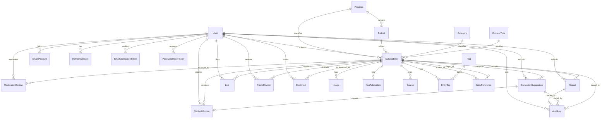

# Database Design

**Phase:** A
**Scope:** Version one database design only

This document defines the planned PostgreSQL and Prisma data model for the Afghan Cultural Information Crowdsourcing Platform. 

## Database Goals And Conventions

- Database: PostgreSQL.
- ORM: Prisma.
- Primary keys: UUIDs for all main records.
- Timestamps: store all timestamps in UTC.
- Prisma models: singular PascalCase, for example `CulturalEntry`.
- Prisma fields: camelCase, for example `publishedAt`.
- Database tables: plural snake_case, for example `cultural_entries`.
- Database columns: snake_case, for example `published_at`.
- Enum values: UPPER_SNAKE_CASE.
- Public cultural entries have unique Persian slugs. Seed/import tooling also uses a stable internal key.
- Persian search uses normalized text stored on the entry for practical PostgreSQL search.
- Soft deletion is used only where preserving cultural history, moderation history, or user-facing history is justified.
- Important workflow changes should happen in transactions and write audit records in the same transaction.
- Controllers must not query Prisma directly; NestJS services own business rules and database access.
- Taxonomies remain flat in v1; category hierarchy is not included.
- Cultural Entries use a simplified `GeographicScope` in v1: one specific province, Afghanistan-wide/national, or no meaningful geographic dependency.

### Display Names, Keys, And Slugs

- `id` is the UUID database identity used by relations.
- `key` is a stable internal Cultural Entry identity for seed/import/tooling. It uses lowercase Latin kebab-case and is immutable after creation.
- `slug` is the public Cultural Entry URL identifier. It supports normalized Persian Unicode and is the canonical public URL.
- Persian taxonomy display names remain in `name`.
- Readable Latin taxonomy slugs remain in `slug`.
- Do not add English-name fields to `Province`, `District`, `Category`, `ContentType`, `Tag`, or other taxonomies.
- Taxonomy slugs may initially be generated through transliteration.
- Slugs remain editable before publication for entries and administratively editable for taxonomies.
- Administrators can manually correct generated slugs.
- A published `CulturalEntry` slug should remain immutable after publication.
- Public Cultural Entry lookups use `slug`; content-library internal links use `targetKey` before database resolution; stored relations continue to use UUID IDs.

## Entity Evaluation For Version One

Version one contains 24 approved entities, including `EntryReference` for manual Wikipedia-style internal links and `Like` for binary appreciation of Cultural Entries.

| Entity               | Decision               | Reason                                                                                                                                          |
| -------------------- | ---------------------- | ----------------------------------------------------------------------------------------------------------------------------------------------- |
| User                 | Keep                   | Required for accounts, profiles, roles, moderation attribution, reviews, corrections, reports, and audit actions.                               |
| OAuthAccount         | Keep                   | Required for linking Google and Facebook social-login accounts to platform users.                                                               |
| CulturalEntry        | Keep                   | Main cultural content object.                                                                                                                   |
| ContentVersion       | Keep                   | Required to preserve submitted and published history.                                                                                           |
| ModerationReview     | Keep                   | Required to record approve, reject, changes-requested, hide, restore, and archive decisions.                                                    |
| EntryReference       | Keep                   | Required for Wikipedia-style internal links between published Cultural Entries.                                                                 |
| Province             | Keep                   | Required public filter and admin-managed taxonomy.                                                                                              |
| District             | Keep as managed record | Districts use managed records. `provinceId` is required on districts, `districtId` on entries is optional, and entries may still keep free-text location. |
| Category             | Keep                   | Required public filter and admin-managed taxonomy.                                                                                              |
| ContentType          | Keep                   | Required public filter and admin-managed taxonomy.                                                                                              |
| Tag                  | Keep                   | Required flexible public filter and admin-managed taxonomy.                                                                                     |
| EntryTag             | Keep                   | Explicit join table supports uniqueness and future metadata without changing the entry/tag relationship.                                        |
| Image                | Keep                   | Required for Cloudinary image metadata and moderation removal without deleting the entry.                                                       |
| YouTubeVideo         | Keep                   | Separate one-to-one optional record keeps video validation/removal isolated from the entry.                                                     |
| Source               | Keep                   | Required for references, oral sources, interviews, and personal experience.                                                                     |
| Like                 | Keep                   | Required binary appreciation, separate from public reviews, with one like per user per entry.                                                    |
| PublicReview         | Keep                   | Required public comments, separate from likes and corrections.                                                                                  |
| Bookmark             | Keep                   | Allows a registered user to privately save a published Cultural Entry.                                                                          |
| CorrectionSuggestion | Keep                   | Required workflow for suggested factual/content corrections.                                                                                    |
| Report               | Keep                   | Required private content complaint workflow.                                                                                                    |
| RefreshSession       | Keep                   | Required by the planned refresh-token authentication design.                                                                                    |
| EmailVerificationToken | Keep                 | Required for email verification after email/password registration.                                                                              |
| PasswordResetToken   | Keep                   | Required by v1 password reset.                                                                                                                  |
| AuditLog             | Keep                   | Required for traceability of important product actions.                                                                                         |

### Complete Entity List

Version one contains 24 entities:

1. `User`
2. `OAuthAccount`
3. `CulturalEntry`
4. `ContentVersion`
5. `ModerationReview`
6. `Province`
7. `District`
8. `Category`
9. `ContentType`
10. `Tag`
11. `EntryTag`
12. `Image`
13. `YouTubeVideo`
14. `Source`
15. `Like`
16. `PublicReview`
17. `Bookmark`
18. `CorrectionSuggestion`
19. `Report`
20. `RefreshSession`
21. `EmailVerificationToken`
22. `PasswordResetToken`
23. `AuditLog`
24. `EntryReference`

## Enums

### UserRole

- `USER`
- `MODERATOR`
- `ADMIN`

### UserStatus

- `ACTIVE`
- `SUSPENDED`

Used for account suspension/reactivation. Version one does not support physical user deletion.

### AuthProvider

- `GOOGLE`
- `FACEBOOK`

### EntryStatus

Uses the practical architecture workflow for version one:

- `DRAFT`
- `PENDING_REVIEW`
- `CHANGES_REQUESTED`
- `PUBLISHED`
- `REJECTED`
- `HIDDEN`
- `ARCHIVED`

The broader PRD mentions `UNDER_REVIEW`, `RESUBMITTED`, `APPROVED`, and `REMOVED`, but the architecture specification narrows v1 to the list above. `APPROVED` is represented by immediate transition to `PUBLISHED`.

### GeographicScope

- `PROVINCE`
- `NATIONAL`
- `NONE`

Meaning and Persian UI labels:

- `PROVINCE` means the entry is tied to one specific province. The website should normally display the selected province name, such as `هرات`, `کابل`, or `بلخ`.
- `NATIONAL` means the entry is Afghanistan-wide. Display label: `سراسر افغانستان`.
- `NONE` means the entry is not meaningfully tied to a geographic location. Display label: `بدون وابستگی جغرافیایی`, or omit the location label when that creates a cleaner interface.

`MULTI_PROVINCE` is intentionally excluded from v1 because it is vague without storing the actual province set. A future `EntryProvince` many-to-many relation may be added only if real filtering and editorial requirements justify it.

### VersionReason

- `INITIAL_SUBMISSION`
- `RESUBMISSION`
- `ACCEPTED_CORRECTION`
- `ADMIN_UPDATE`

### ModerationDecision

- `APPROVE`
- `REQUEST_CHANGES`
- `REJECT`
- `HIDE`
- `RESTORE`
- `ARCHIVE`

### CorrectionStatus

- `PENDING`
- `ACCEPTED`
- `REJECTED`

### ReportStatus

- `OPEN`
- `UNDER_REVIEW`
- `RESOLVED`

### ReportReason

- `INACCURATE_INFORMATION`
- `OFFENSIVE_OR_DISCRIMINATORY_CONTENT`
- `COPYRIGHT_PROBLEM`
- `PRIVACY_PROBLEM`
- `INCORRECT_PROVINCE_OR_CATEGORY`
- `DUPLICATE_CONTENT`
- `MISSING_OR_MISLEADING_SOURCE`
- `CULTURALLY_SENSITIVE_CONTENT`
- `INVALID_YOUTUBE_LINK`
- `SPAM`
- `OTHER`

### ReportResolutionAction

- `DISMISS`
- `HIDE_CONTENT`
- `REQUEST_CORRECTIONS`
- `REMOVE_IMAGE`
- `REMOVE_YOUTUBE_VIDEO`
- `ARCHIVE_CONTENT`
- `ESCALATE_TO_ADMIN`

### SourceType

- `BOOK`
- `ACADEMIC_ARTICLE`
- `WEBSITE`
- `ARCHIVE`
- `INTERVIEW`
- `ORAL_SOURCE`
- `PERSONAL_EXPERIENCE`
- `MUSEUM_OR_INSTITUTION`
- `OTHER`

### PublicReviewStatus

- `ACTIVE`
- `HIDDEN`
- `DELETED`

This is the review-status equivalent needed for v1 because users may delete their own reviews and moderators may hide inappropriate reviews.

### AuditAction

- `ENTRY_SUBMITTED`
- `ENTRY_APPROVED`
- `ENTRY_REJECTED`
- `ENTRY_CHANGES_REQUESTED`
- `ENTRY_HIDDEN`
- `ENTRY_ARCHIVED`
- `ENTRY_RESTORED`
- `CORRECTION_ACCEPTED`
- `REPORT_RESOLVED`
- `USER_ROLE_CHANGED`
- `USER_SUSPENDED`

More audit actions can be added later only when new v1 workflows require them.

## Entity Definitions

### User

**Purpose:** Stores account, authentication, public profile, role, and suspension state.

| Field             | Type             | Required | Default       | Notes                                                             |
| ----------------- | ---------------- | -------- | ------------- | ----------------------------------------------------------------- |
| id                | UUID             | Yes      | `uuid()`    | Primary key.                                                      |
| email             | String           | Yes      | None          | Stored normalized lowercase.                                      |
| passwordHash      | String           | No       | None          | Optional because OAuth-only users may not have a password. Never returned by API. |
| role              | UserRole         | Yes      | `USER`      | One stored role per user in v1.                                   |
| status            | UserStatus       | Yes      | `ACTIVE`    | Suspended users cannot perform protected actions.                 |
| displayName       | String           | Yes      | None          | Public name.                                                      |
| profileImageUrl   | String           | No       | None          | Optional public profile image.                                    |
| biography         | String           | No       | None          | Short profile text.                                               |
| provinceId        | UUID             | No       | None          | Optional profile province.                                        |
| culturalInterests | String[]         | Yes      | Empty array   | Simple list of Persian cultural-interest labels.                  |
| emailVerifiedAt   | DateTime         | No       | None          | Mandatory in v1 before full account use; nullable until verified. |
| lastLoginAt       | DateTime         | No       | None          | Useful for account administration.                                |
| suspendedAt       | DateTime         | No       | None          | Set when status becomes`SUSPENDED`.                             |
| createdAt         | DateTime         | Yes      | `now()`     | UTC.                                                              |
| updatedAt         | DateTime         | Yes      | `updatedAt` | UTC.                                                              |

**Unique constraints:** `email`.

**Indexes:** `role`, `status`, `provinceId`, `createdAt`.

**Relations:** OAuth accounts, entries, content versions created, moderation reviews, correction suggestions, reports, likes, public reviews, bookmarks, refresh sessions, email verification tokens, password reset tokens, audit logs as actor or target.

**Deletion behavior:** Version one uses suspension only and does not support physical user deletion. Published cultural history, content versions, audit logs, reviews, reports, and moderation records remain preserved.

### OAuthAccount

**Purpose:** Stores a social-login account linked to a platform user.

| Field             | Type         | Required | Default       | Notes                                      |
| ----------------- | ------------ | -------- | ------------- | ------------------------------------------ |
| id                | UUID         | Yes      | `uuid()`      | Primary key.                               |
| userId            | UUID         | Yes      | None          | Linked platform user.                      |
| provider          | AuthProvider | Yes      | None          | Google or Facebook.                        |
| providerAccountId | String       | Yes      | None          | Stable provider account identifier.        |
| providerEmail     | String       | No       | None          | Email returned by provider, when available. |
| createdAt         | DateTime     | Yes      | `now()`       | UTC.                                       |
| updatedAt         | DateTime     | Yes      | `updatedAt`   | UTC.                                       |

**Unique constraints:** `(provider, providerAccountId)`, `(userId, provider)`.

**Indexes:** `userId`, `provider`, `providerEmail`.

**Relations:** User.

**Deletion behavior:** Cascade-delete OAuth account records if a user is physically removed in a future version. Suspending a user must not delete linked OAuth accounts.

**Business rules:** Only verified provider emails may be used for automatic account linking. A provider account cannot belong to more than one user. Provider tokens are not stored as application sessions. The backend issues its own access and refresh tokens after successful OAuth login.

### CulturalEntry

**Purpose:** Main cultural content record for articles, oral histories, traditions, places, and practices.

| Field                | Type        | Required        | Default       | Notes                                                                  |
| -------------------- | ----------- | --------------- | ------------- | ---------------------------------------------------------------------- |
| id                   | UUID        | Yes             | `uuid()`    | Primary key.                                                           |
| key                  | String      | Yes             | None          | Stable internal lowercase Latin kebab-case identity for seed/import/tooling. |
| slug                 | String      | Yes             | None          | Public normalized Persian URL slug.                                    |
| title                | String      | Yes             | None          | Persian title.                                                         |
| summary              | String      | Yes             | None          | Short Persian summary.                                                 |
| contentJson          | Json        | Yes             | None          | Tiptap JSON document.                                                  |
| plainTextContent     | String      | Yes             | None          | Extracted text for search and moderation.                              |
| normalizedSearchText | String      | Yes             | Empty string  | Persian-normalized title, summary, body, tags, taxonomy, and location. |
| status               | EntryStatus | Yes             | `DRAFT`     | Public search shows only`PUBLISHED`.                                 |
| geographicScope      | GeographicScope | Yes        | `PROVINCE`  | `PROVINCE`, `NATIONAL`, or `NONE`.                                    |
| authorId             | UUID        | Yes             | None          | Entry author; preserved because v1 does not physically delete users.   |
| provinceId           | UUID        | No              | None          | Required only when `geographicScope = PROVINCE`.                       |
| districtId           | UUID        | No              | None          | Optional only when `geographicScope = PROVINCE`; must belong to province. |
| categoryId           | UUID        | Yes             | None          | Required taxonomy.                                                     |
| contentTypeId        | UUID        | Yes             | None          | Required taxonomy.                                                     |
| villageOrLocation    | String      | No              | None          | Free-text local detail.                                                |
| historicalPeriod     | String      | No              | None          | Optional.                                                              |
| culturalCommunity    | String      | No              | None          | Optional.                                                              |
| alternativeLocalName | String      | No              | None          | Optional.                                                              |
| regionalDifferences  | String      | No              | None          | Optional notes.                                                        |
| viewCount            | Int         | Yes             | `0`         | Used for sorting, not critical to correctness.                         |
| submittedAt          | DateTime    | No              | None          | First submission timestamp.                                            |
| publishedAt          | DateTime    | No              | None          | Set when published.                                                    |
| hiddenAt             | DateTime    | No              | None          | Set when hidden.                                                       |
| archivedAt           | DateTime    | No              | None          | Set when archived.                                                     |
| createdAt            | DateTime    | Yes             | `now()`     | UTC.                                                                   |
| updatedAt            | DateTime    | Yes             | `updatedAt` | UTC.                                                                   |

**Unique constraints:** `key`, `slug`.

**Indexes:** `status`, `geographicScope`, `provinceId`, `districtId`, `categoryId`, `contentTypeId`, `authorId`, `publishedAt`, `createdAt`, `(status, publishedAt)`, `(status, provinceId)`, `(geographicScope, provinceId)`, `(status, categoryId)`, `(status, contentTypeId)`.

**Relations:** Author, optional province, optional district, category, content type, tags through `EntryTag`, images, optional YouTube video, sources, outgoing and incoming internal references through `EntryReference`, content versions, moderation reviews, likes, public reviews, bookmarks, correction suggestions, reports.

**Deletion behavior:** Do not physically delete published cultural entries. Use status transitions: `DRAFT` may be hard-deleted by the author before submission; submitted/published entries should use `REJECTED`, `HIDDEN`, or `ARCHIVED`. Audit logs and content versions remain preserved.

### ContentVersion

**Purpose:** Immutable snapshot of submitted, resubmitted, accepted-correction, and admin-updated entry content.

| Field                  | Type          | Required | Default    | Notes                                                  |
| ---------------------- | ------------- | -------- | ---------- | ------------------------------------------------------ |
| id                     | UUID          | Yes      | `uuid()` | Primary key.                                           |
| entryId                | UUID          | Yes      | None       | Parent entry.                                          |
| versionNumber          | Int           | Yes      | None       | Sequential per entry.                                  |
| snapshot               | Json          | Yes      | None       | Full reconstruction snapshot.                          |
| plainTextContent       | String        | Yes      | None       | Snapshot plain text.                                   |
| versionReason          | VersionReason | Yes      | None       | Why this version exists.                               |
| createdById            | UUID          | No       | None       | User, moderator, or admin who caused version creation. |
| correctionSuggestionId | UUID          | No       | None       | Set for accepted corrections.                          |
| moderationReviewId     | UUID          | No       | None       | Set when tied to moderation.                           |
| createdAt              | DateTime      | Yes      | `now()`  | UTC.                                                   |

**Unique constraints:** `(entryId, versionNumber)`.

**Indexes:** `entryId`, `createdById`, `versionReason`, `createdAt`.

**Relations:** Cultural entry, creator, optional correction suggestion, optional moderation review.

**Deletion behavior:** Preserve permanently. Do not cascade-delete from users or entries because versions are historical records.

### EntryReference

**Purpose:** Stores manually created Wikipedia-style internal links from one Cultural Entry to another Cultural Entry.

| Field         | Type     | Required | Default    | Notes                                                                            |
| ------------- | -------- | -------- | ---------- | -------------------------------------------------------------------------------- |
| id            | UUID     | Yes      | `uuid()` | Primary key.                                                                     |
| sourceEntryId | UUID     | Yes      | None       | Entry that contains the internal link.                                           |
| targetEntryId | UUID     | Yes      | None       | Published entry selected as the target. This ID is authoritative.                |
| anchorText    | String   | Yes      | None       | Visible selected text used as the link label.                                    |
| createdAt     | DateTime | Yes      | `now()`  | UTC.                                                                             |

**Unique constraints:** Recommended unique `(sourceEntryId, targetEntryId, anchorText)` to prevent exact duplicate links while still allowing distinct anchor text when editorially justified.

**Indexes:** `sourceEntryId`, `targetEntryId`, `(sourceEntryId, targetEntryId)`, `(targetEntryId, createdAt)`.

**Relations:** Source Cultural Entry as outgoing references; target Cultural Entry as incoming references.

**Deletion behavior:** Preserve references for submitted and published entries. Do not physically delete references from published history without a moderation/admin action. If a draft entry is hard-deleted, its outgoing references may cascade. If a target becomes hidden, archived, or otherwise unavailable, public rendering must handle the reference safely rather than producing a broken experience.

**Business rules:** Only `PUBLISHED` entries may be selected as targets. An entry cannot reference itself. Contributors create links manually by selecting text in the Tiptap editor. Moderators may review or remove incorrect references. Anchor text should be descriptive, and excessive repeated linking should be avoided. Automatic keyword detection and link suggestions are deferred.

### ModerationReview

**Purpose:** Records moderator/admin decisions and comments for entry workflow changes.

| Field          | Type               | Required | Default    | Notes                                                     |
| -------------- | ------------------ | -------- | ---------- | --------------------------------------------------------- |
| id             | UUID               | Yes      | `uuid()` | Primary key.                                              |
| entryId        | UUID               | Yes      | None       | Entry reviewed.                                           |
| moderatorId    | UUID               | Yes      | None       | Reviewer.                                                 |
| decision       | ModerationDecision | Yes      | None       | Approve, request changes, reject, hide, restore, archive. |
| comments       | String             | No       | None       | Required by service for reject/request changes.           |
| previousStatus | EntryStatus        | Yes      | None       | Audit-friendly workflow trace.                            |
| nextStatus     | EntryStatus        | Yes      | None       | Resulting status.                                         |
| createdAt      | DateTime           | Yes      | `now()`  | UTC.                                                      |

**Unique constraints:** None.

**Indexes:** `entryId`, `moderatorId`, `decision`, `createdAt`, `(decision, createdAt)`.

**Relations:** Cultural entry, moderator, related content versions.

**Deletion behavior:** Preserve. Suspending a user must not remove moderation history.

### Province

**Purpose:** Admin-managed geographic taxonomy and public filter.

| Field                   | Type     | Required | Default       | Notes                                                     |
| ----------------------- | -------- | -------- | ------------- | --------------------------------------------------------- |
| id                      | UUID     | Yes      | `uuid()`      | Primary key.                                              |
| name                    | String   | Yes      | None          | Persian display name.                                     |
| slug                    | String   | Yes      | None          | Backend-generated public URL/filter slug.                 |
| description             | String   | No       | `null`        | Public province introduction, maximum 500 characters.     |
| imageCloudinaryPublicId | String   | No       | `null`        | Unique backend-only Cloudinary asset identity.            |
| imageSecureUrl          | String   | No       | `null`        | Managed source image URL.                                 |
| imageThumbnailUrl       | String   | No       | `null`        | Managed card/list delivery URL.                           |
| imageAltText            | String   | No       | `null`        | Required when a managed image exists; maximum 220 chars.  |
| imageWidth              | Int      | No       | `null`        | Source width for stable rendering.                        |
| imageHeight             | Int      | No       | `null`        | Source height for stable rendering.                       |
| sortOrder               | Int      | Yes      | `0`           | Admin ordering.                                           |
| isActive                | Boolean  | Yes      | `true`        | Hide from new submissions without deleting.               |
| createdAt               | DateTime | Yes      | `now()`       | UTC.                                                      |
| updatedAt               | DateTime | Yes      | `updatedAt`   | UTC.                                                      |

**Unique constraints:** `name`, `slug`, optional `imageCloudinaryPublicId`.

**Indexes:** `isActive`, `sortOrder`.

**Relations:** Users as optional profile province, cultural entries, districts.

**Deletion behavior:** Restrict deletion while referenced by users, districts, or entries. Prefer `isActive = false`.

**Image behavior:** A province has at most one managed Cloudinary image. Image metadata is either
fully empty or contains a public ID, secure URL, thumbnail URL, and alt text. Public responses omit
the Cloudinary public ID. Existing bundled frontend province images remain a display fallback and
are not imported by taxonomy seeding.

### District

**Purpose:** Optional geographic detail under a province.

| Field      | Type     | Required | Default       | Notes                                       |
| ---------- | -------- | -------- | ------------- | ------------------------------------------- |
| id         | UUID     | Yes      | `uuid()`    | Primary key.                                |
| provinceId | UUID     | Yes      | None          | Parent province.                            |
| name       | String   | Yes      | None          | Persian display name.                       |
| slug       | String   | Yes      | None          | URL/filter slug within province.            |
| sortOrder  | Int      | Yes      | `0`         | Admin ordering.                             |
| isActive   | Boolean  | Yes      | `true`      | Hide from new submissions without deleting. |
| createdAt  | DateTime | Yes      | `now()`     | UTC.                                        |
| updatedAt  | DateTime | Yes      | `updatedAt` | UTC.                                        |

**Unique constraints:** `(provinceId, name)`, `(provinceId, slug)`.

**Indexes:** `provinceId`, `isActive`, `sortOrder`.

**Relations:** Province, cultural entries.

**Deletion behavior:** Restrict while referenced by entries. Prefer `isActive = false`.

### Category

**Purpose:** Admin-managed flat cultural taxonomy and public filter. Category hierarchy is not included in v1.

| Field       | Type     | Required | Default       | Notes                                       |
| ----------- | -------- | -------- | ------------- | ------------------------------------------- |
| id          | UUID     | Yes      | `uuid()`    | Primary key.                                |
| name        | String   | Yes      | None          | Persian display name.                       |
| slug        | String   | Yes      | None          | Public URL/filter slug.                     |
| description | String   | No       | None          | Optional admin text.                        |
| sortOrder   | Int      | Yes      | `0`         | Admin ordering.                             |
| isActive    | Boolean  | Yes      | `true`      | Hide from new submissions without deleting. |
| createdAt   | DateTime | Yes      | `now()`     | UTC.                                        |
| updatedAt   | DateTime | Yes      | `updatedAt` | UTC.                                        |

**Unique constraints:** `name`, `slug`.

**Indexes:** `isActive`, `sortOrder`.

**Relations:** Cultural entries.

**Deletion behavior:** Restrict while referenced. Prefer `isActive = false`.

### ContentType

**Purpose:** Admin-managed entry type taxonomy for article, story/oral history, tradition, place, and practice.

| Field       | Type     | Required | Default       | Notes                                       |
| ----------- | -------- | -------- | ------------- | ------------------------------------------- |
| id          | UUID     | Yes      | `uuid()`    | Primary key.                                |
| name        | String   | Yes      | None          | Persian display name.                       |
| slug        | String   | Yes      | None          | Public URL/filter slug.                     |
| description | String   | No       | None          | Optional admin text.                        |
| sortOrder   | Int      | Yes      | `0`         | Admin ordering.                             |
| isActive    | Boolean  | Yes      | `true`      | Hide from new submissions without deleting. |
| createdAt   | DateTime | Yes      | `now()`     | UTC.                                        |
| updatedAt   | DateTime | Yes      | `updatedAt` | UTC.                                        |

**Unique constraints:** `name`, `slug`.

**Indexes:** `isActive`, `sortOrder`.

**Relations:** Cultural entries.

**Deletion behavior:** Restrict while referenced. Prefer `isActive = false`.

### Tag

**Purpose:** Flexible topic label for browsing and search.

| Field          | Type     | Required | Default       | Notes                                           |
| -------------- | -------- | -------- | ------------- | ----------------------------------------------- |
| id             | UUID     | Yes      | `uuid()`    | Primary key.                                    |
| name           | String   | Yes      | None          | Persian tag text.                               |
| slug           | String   | Yes      | None          | Public URL/filter slug.                         |
| normalizedName | String   | Yes      | None          | Persian-normalized value for uniqueness/search. |
| isActive       | Boolean  | Yes      | `true`      | Hide from new submissions without deleting.     |
| createdAt      | DateTime | Yes      | `now()`     | UTC.                                            |
| updatedAt      | DateTime | Yes      | `updatedAt` | UTC.                                            |

**Unique constraints:** `slug`, `normalizedName`.

**Indexes:** `isActive`, `name`.

**Relations:** Cultural entries through `EntryTag`.

**Deletion behavior:** Restrict while referenced. Prefer `isActive = false` or merging tags in an admin action.

### EntryTag

**Purpose:** Explicit many-to-many join between entries and tags.

| Field     | Type     | Required | Default   | Notes                       |
| --------- | -------- | -------- | --------- | --------------------------- |
| entryId   | UUID     | Yes      | None      | Composite primary key part. |
| tagId     | UUID     | Yes      | None      | Composite primary key part. |
| createdAt | DateTime | Yes      | `now()` | UTC.                        |

**Unique constraints:** `(entryId, tagId)` as primary key or unique composite.

**Indexes:** `tagId`, `entryId`.

**Relations:** Cultural entry, tag.

**Deletion behavior:** Cascade when a draft entry is hard-deleted. Restrict tag deletion while referenced. For archived/published entries, preserve tag relationships.

### Image

**Purpose:** Stores Cloudinary image metadata and moderation state for entry images.

| Field                | Type     | Required | Default       | Notes                                                  |
| -------------------- | -------- | -------- | ------------- | ------------------------------------------------------ |
| id                   | UUID     | Yes      | `uuid()`    | Primary key.                                           |
| entryId              | UUID     | Yes      | None          | Parent entry.                                          |
| uploadedById         | UUID     | No       | None          | Contributor/uploader.                                  |
| cloudinaryPublicId   | String   | Yes      | None          | Cloudinary asset identifier.                           |
| url                  | String   | Yes      | None          | Delivered image URL.                                   |
| secureUrl            | String   | Yes      | None          | Full HTTPS image URL.                                  |
| thumbnailUrl         | String   | No       | None          | Optimized Cloudinary thumbnail for listing views.      |
| width                | Int      | No       | None          | Metadata.                                              |
| height               | Int      | No       | None          | Metadata.                                              |
| format               | String   | No       | None          | JPEG, PNG, WebP.                                       |
| bytes                | Int      | No       | None          | File size.                                             |
| caption              | String   | No       | None          | Display caption.                                       |
| altText              | String   | Yes      | None          | Required for accessibility before publication.         |
| photographerOrSource | String   | No       | None          | Optional source attribution.                           |
| permissionConfirmed  | Boolean  | Yes      | `false`     | Must be true before publication.                       |
| displayOrder         | Int      | Yes      | `0`         | Entry image ordering.                                  |
| isRemoved            | Boolean  | Yes      | `false`     | Moderator can remove one image without deleting entry. |
| removedById          | UUID     | No       | None          | Moderator/admin.                                       |
| removedAt            | DateTime | No       | None          | UTC.                                                   |
| createdAt            | DateTime | Yes      | `now()`     | UTC.                                                   |
| updatedAt            | DateTime | Yes      | `updatedAt` | UTC.                                                   |

**Unique constraints:** `cloudinaryPublicId`.

**Indexes:** `entryId`, `uploadedById`, `(entryId, displayOrder)`, `isRemoved`.

**Relations:** Cultural entry, uploader, optional remover.

**Deletion behavior:** Draft image records may be deleted when a draft is deleted. For submitted/published entries, use `isRemoved` so content versions and audit history can explain image changes.

**Image URL usage:** `secureUrl` is used for the full image. `thumbnailUrl` is used for smaller cards, search results, dashboards, and listing pages. Cloudinary may generate the thumbnail through an optimized transformation.

### YouTubeVideo

**Purpose:** Stores one optional validated YouTube link per entry.

| Field       | Type     | Required | Default       | Notes                                            |
| ----------- | -------- | -------- | ------------- | ------------------------------------------------ |
| id          | UUID     | Yes      | `uuid()`    | Primary key.                                     |
| entryId     | UUID     | Yes      | None          | Parent entry.                                    |
| videoId     | String   | Yes      | None          | Extracted YouTube ID.                            |
| url         | String   | Yes      | None          | Submitted supported YouTube URL.                 |
| title       | String   | No       | None          | Optional contributor-supplied title.             |
| description | String   | No       | None          | Optional description.                            |
| isRemoved   | Boolean  | Yes      | `false`     | Moderator can remove invalid/inappropriate link. |
| removedById | UUID     | No       | None          | Moderator/admin.                                 |
| removedAt   | DateTime | No       | None          | UTC.                                             |
| createdAt   | DateTime | Yes      | `now()`     | UTC.                                             |
| updatedAt   | DateTime | Yes      | `updatedAt` | UTC.                                             |

**Unique constraints:** `entryId` to enforce one optional YouTube video per entry.

**Indexes:** `videoId`, `isRemoved`.

**Relations:** Cultural entry, optional remover.

**Deletion behavior:** Draft video may be deleted with a draft. For submitted/published entries, use `isRemoved`.

### Source

**Purpose:** Stores references for written, oral, interview, archive, and personal-experience sources.

| Field                | Type       | Required | Default       | Notes                                                   |
| -------------------- | ---------- | -------- | ------------- | ------------------------------------------------------- |
| id                   | UUID       | Yes      | `uuid()`    | Primary key.                                            |
| entryId              | UUID       | Yes      | None          | Parent entry.                                           |
| type                 | SourceType | Yes      | None          | Source classification.                                  |
| title                | String     | No       | None          | Optional for oral/personal sources.                     |
| authorOrProvider     | String     | No       | None          | Author, provider, or interviewed person.                |
| publicationDate      | String     | No       | None          | String avoids forcing partial dates into invalid dates. |
| websiteUrl           | String     | No       | None          | Optional URL.                                           |
| bookOrArticleDetails | String     | No       | None          | Publisher, journal, pages, etc.                         |
| interviewDate        | DateTime   | No       | None          | Optional for interviews.                                |
| explanation          | String     | No       | None          | Additional context.                                     |
| displayOrder         | Int        | Yes      | `0`         | Source ordering.                                        |
| createdAt            | DateTime   | Yes      | `now()`     | UTC.                                                    |
| updatedAt            | DateTime   | Yes      | `updatedAt` | UTC.                                                    |

**Unique constraints:** None for v1.

**Indexes:** `entryId`, `type`, `(entryId, displayOrder)`.

**Relations:** Cultural entry.

**Deletion behavior:** Draft sources may be edited/deleted. Sources attached to submitted/published content should be preserved through content versions; direct deletion from current entry should create a new version when published.

### Like

**Purpose:** Stores a binary user like for a published Cultural Entry, separate from public reviews.

| Field     | Type     | Required | Default    | Notes                    |
| --------- | -------- | -------- | ---------- | ------------------------ |
| id        | UUID     | Yes      | `uuid()` | Primary key.             |
| userId    | UUID     | Yes      | None       | User who liked the entry. |
| entryId   | UUID     | Yes      | None       | Published entry liked.   |
| createdAt | DateTime | Yes      | `now()`  | UTC timestamp.           |

**Unique constraints:** `(userId, entryId)` prevents duplicate likes at the database level.

**Indexes:** `userId`, `entryId`.

**Relations:** User, Cultural Entry.

**Deletion behavior:** Unlike physically removes the lightweight interaction row. User removal cascade-deletes that user's likes; Cultural Entries remain protected from physical deletion by the entry relation.

**Business rules:** Only authenticated, active, email-verified users may like or unlike. Only published entries may be liked. Like and unlike operations are idempotent. Public responses expose only the aggregate count; user identities are private. Authenticated interaction state may expose whether the current user liked the entry.

### PublicReview

**Purpose:** Stores public comments about an entry, separate from likes and corrections.

| Field      | Type               | Required | Default       | Notes                            |
| ---------- | ------------------ | -------- | ------------- | -------------------------------- |
| id         | UUID               | Yes      | `uuid()`    | Primary key.                     |
| entryId    | UUID               | Yes      | None          | Reviewed entry.                  |
| userId     | UUID               | Yes      | None          | Reviewer.                        |
| body       | String             | Yes      | None          | Public review text.              |
| status     | PublicReviewStatus | Yes      | `ACTIVE`    | Active, hidden, or user-deleted. |
| hiddenById | UUID               | No       | None          | Moderator/admin who hid it.      |
| hiddenAt   | DateTime           | No       | None          | UTC.                             |
| deletedAt  | DateTime           | No       | None          | UTC.                             |
| createdAt  | DateTime           | Yes      | `now()`     | UTC.                             |
| updatedAt  | DateTime           | Yes      | `updatedAt` | UTC.                             |

**Unique constraints:** One active public review per user per entry must be enforced with a PostgreSQL partial unique index on `(user_id, entry_id) WHERE status = 'ACTIVE'`. Prisma cannot define this directly in `schema.prisma`, so the generated migration must include a manual SQL index with a clear explanatory comment. Do not add a normal Prisma `@@unique([userId, entryId])` because users must be able to create a new review after a previous review becomes `DELETED` or `HIDDEN`.

**Indexes:** `entryId`, `userId`, `status`, `(entryId, status)`, `createdAt`.

**Relations:** Cultural entry, user, optional hider.

**Deletion behavior:** Use status-based soft deletion (`DELETED`) rather than physical deletion so moderation and dashboard history remain consistent.

### Bookmark

**Purpose:** Allows a registered user to privately save a published Cultural Entry.

| Field     | Type     | Required | Default    | Notes           |
| --------- | -------- | -------- | ---------- | --------------- |
| id        | UUID     | Yes      | `uuid()` | Primary key.    |
| userId    | UUID     | Yes      | None       | Bookmark owner. |
| entryId   | UUID     | Yes      | None       | Saved entry.    |
| createdAt | DateTime | Yes      | `now()`  | UTC timestamp.  |

**Unique constraints:** `(userId, entryId)`.

**Indexes:** `userId`, `entryId`, `(userId, createdAt)`.

**Relations:** User, Cultural Entry.

**Deletion behavior:** A user may remove a bookmark through hard deletion. Bookmark deletion does not require versioning or audit history. If user deletion or anonymization is implemented in a future version, the user's bookmarks may be cascade-deleted. Published entries are normally archived rather than physically deleted. Bookmarks for hidden or archived entries may remain stored, but inaccessible content must not be exposed publicly.

**Business rules:** Only authenticated, active, email-verified users can create or remove bookmarks. Only published entries can be bookmarked. A user cannot bookmark the same entry more than once. Bookmark lists are private, while public APIs may expose only the aggregate bookmark count. Bookmarking does not change moderation status or view count. Creating and removing bookmarks should be idempotent where practical.

### CorrectionSuggestion

**Purpose:** Stores proposed corrections for published cultural entries.

| Field              | Type             | Required | Default       | Notes                             |
| ------------------ | ---------------- | -------- | ------------- | --------------------------------- |
| id                 | UUID             | Yes      | `uuid()`    | Primary key.                      |
| entryId            | UUID             | Yes      | None          | Entry being corrected.            |
| submittedById      | UUID             | Yes      | None          | Suggesting user.                  |
| reviewedById       | UUID             | No       | None          | Moderator/admin reviewer.         |
| status             | CorrectionStatus | Yes      | `PENDING`   | Pending, accepted, rejected.      |
| section            | String           | Yes      | None          | Incorrect/incomplete section.     |
| proposedCorrection | String           | Yes      | None          | Proposed replacement/addition.    |
| reason             | String           | Yes      | None          | Required explanation.             |
| sourceText         | String           | No       | None          | Optional source provided by user. |
| reviewerComments   | String           | No       | None          | Moderator response.               |
| acceptedVersionId  | UUID             | No       | None          | New version created if accepted.  |
| submittedAt        | DateTime         | Yes      | `now()`     | UTC.                              |
| reviewedAt         | DateTime         | No       | None          | UTC.                              |
| createdAt          | DateTime         | Yes      | `now()`     | UTC.                              |
| updatedAt          | DateTime         | Yes      | `updatedAt` | UTC.                              |

**Unique constraints:** None.

**Indexes:** `entryId`, `submittedById`, `reviewedById`, `status`, `submittedAt`, `(status, submittedAt)`.

**Relations:** Cultural entry, submitting user, reviewing user, optional accepted content version.

**Deletion behavior:** Preserve. Corrections are part of cultural-content history and moderation accountability.

### Report

**Purpose:** Stores private content or policy complaints and their moderation resolution.

| Field            | Type                   | Required | Default       | Notes                            |
| ---------------- | ---------------------- | -------- | ------------- | -------------------------------- |
| id               | UUID                   | Yes      | `uuid()`    | Primary key.                     |
| entryId          | UUID                   | Yes      | None          | Reported entry.                  |
| reportedById     | UUID                   | Yes      | None          | Reporter.                        |
| reviewedById     | UUID                   | No       | None          | Moderator/admin handling report. |
| reason           | ReportReason           | Yes      | None          | Required reason.                 |
| explanation      | String                 | Yes      | None          | Required details.                |
| status           | ReportStatus           | Yes      | `OPEN`      | Open, under review, resolved.    |
| resolutionAction | ReportResolutionAction | No       | None          | Set when resolved.               |
| resolutionNotes  | String                 | No       | None          | Moderator/admin notes.           |
| resolvedAt       | DateTime               | No       | None          | UTC.                             |
| createdAt        | DateTime               | Yes      | `now()`     | UTC.                             |
| updatedAt        | DateTime               | Yes      | `updatedAt` | UTC.                             |

**Unique constraints:** None for v1. A duplicate-report prevention rule can be added later if needed.

**Indexes:** `entryId`, `reportedById`, `reviewedById`, `status`, `reason`, `createdAt`, `(status, createdAt)`.

**Relations:** Cultural entry, reporting user, reviewing user.

**Deletion behavior:** Preserve privately. Reports must not be publicly displayed and should not be destroyed when content is archived.

### RefreshSession

**Purpose:** Stores hashed refresh tokens for secure session refresh and revocation.

| Field        | Type     | Required | Default       | Notes                          |
| ------------ | -------- | -------- | ------------- | ------------------------------ |
| id           | UUID     | Yes      | `uuid()`    | Primary key.                   |
| userId       | UUID     | Yes      | None          | Session owner.                 |
| tokenHash    | String   | Yes      | None          | Hash only, never raw token.    |
| expiresAt    | DateTime | Yes      | None          | Recommended 7 days from issue. |
| revokedAt    | DateTime | No       | None          | Set on logout/revocation.      |
| replacedById | UUID     | No       | None          | Optional rotation chain.       |
| userAgent    | String   | No       | None          | Basic session metadata.        |
| ipAddress    | String   | No       | None          | Basic session metadata.        |
| createdAt    | DateTime | Yes      | `now()`     | UTC.                           |
| updatedAt    | DateTime | Yes      | `updatedAt` | UTC.                           |

**Unique constraints:** `tokenHash`.

**Indexes:** `userId`, `expiresAt`, `revokedAt`.

**Relations:** User, optional replacement refresh session.

**Deletion behavior:** Cascade or scheduled cleanup is acceptable after expiry because refresh sessions are security/session state, not cultural history. Audit important auth events separately.

### PasswordResetToken

**Purpose:** Stores hashed password-reset tokens with expiration and single-use tracking.

| Field     | Type     | Required | Default    | Notes                       |
| --------- | -------- | -------- | ---------- | --------------------------- |
| id        | UUID     | Yes      | `uuid()` | Primary key.                |
| userId    | UUID     | Yes      | None       | Reset owner.                |
| tokenHash | String   | Yes      | None       | Hash only, never raw token. |
| expiresAt | DateTime | Yes      | None       | Required.                   |
| usedAt    | DateTime | No       | None       | Set after successful reset. |
| createdAt | DateTime | Yes      | `now()`  | UTC.                        |

**Unique constraints:** `tokenHash`.

**Indexes:** `userId`, `expiresAt`, `usedAt`.

**Relations:** User.

**Deletion behavior:** Cascade or scheduled cleanup is acceptable after expiry/use. Audit password reset actions separately.

### EmailVerificationToken

**Purpose:** Stores hashed email-verification tokens with expiration and single-use tracking.

| Field     | Type     | Required | Default    | Notes                                      |
| --------- | -------- | -------- | ---------- | ------------------------------------------ |
| id        | UUID     | Yes      | `uuid()` | Primary key.                               |
| userId    | UUID     | Yes      | None       | Verification-token owner.                  |
| tokenHash | String   | Yes      | None       | Hash only, never raw token.                |
| expiresAt | DateTime | Yes      | None       | Required; registration tokens expire in v1. |
| usedAt    | DateTime | No       | None       | Set after successful email verification.   |
| createdAt | DateTime | Yes      | `now()`  | UTC.                                       |

**Unique constraints:** `tokenHash`.

**Indexes:** `userId`, `expiresAt`, `usedAt`.

**Relations:** User.

**Deletion behavior:** Cascade or scheduled cleanup is acceptable after expiry/use because verification tokens are security state, not cultural history. Audit important account actions separately when audit workflows are implemented.

### AuditLog

**Purpose:** Immutable trace of important user, moderation, correction, report, and admin actions.

| Field                  | Type        | Required | Default    | Notes                                                       |
| ---------------------- | ----------- | -------- | ---------- | ----------------------------------------------------------- |
| id                     | UUID        | Yes      | `uuid()` | Primary key.                                                |
| action                 | AuditAction | Yes      | None       | Important product action.                                   |
| actorId                | UUID        | No       | None       | User who performed action; null for system/anonymized user. |
| targetUserId           | UUID        | No       | None       | Affected user when relevant.                                |
| entryId                | UUID        | No       | None       | Affected entry when relevant.                               |
| reportId               | UUID        | No       | None       | Related report when relevant.                               |
| correctionSuggestionId | UUID        | No       | None       | Related correction when relevant.                           |
| metadata               | Json        | No       | None       | Minimal contextual details.                                 |
| requestId              | String      | No       | None       | Request ID from middleware.                                 |
| ipAddress              | String      | No       | None       | Optional security metadata.                                 |
| userAgent              | String      | No       | None       | Optional security metadata.                                 |
| createdAt              | DateTime    | Yes      | `now()`  | UTC.                                                        |

**Unique constraints:** None.

**Indexes:** `action`, `actorId`, `targetUserId`, `entryId`, `reportId`, `correctionSuggestionId`, `createdAt`, `(action, createdAt)`.

**Relations:** Optional actor, target user, entry, report, correction suggestion.

**Deletion behavior:** Preserve permanently. Audit logs must not cascade-delete with users, entries, reports, or corrections.

## Main Relationships

- `User` to `CulturalEntry`: one user authors many entries.
- `CulturalEntry` to `Province`: many entries may belong to one province when `geographicScope = PROVINCE`; national and non-geographic entries have no province.
- `CulturalEntry` to `District`: many entries may belong to one district when `geographicScope = PROVINCE`; district is optional and must belong to the selected province.
- `CulturalEntry` to `Category`: many entries belong to one category.
- `CulturalEntry` to `ContentType`: many entries belong to one content type.
- `CulturalEntry` to `Tag`: many-to-many through `EntryTag`.
- `CulturalEntry` to `Image`: one entry has zero to many images.
- `CulturalEntry` to `YouTubeVideo`: one entry has zero or one YouTube video in v1.
- `CulturalEntry` to `Source`: one entry has zero to many sources.
- `CulturalEntry` to `ContentVersion`: one entry has one to many permanent versions after submission.
- `CulturalEntry` to `EntryReference`: one entry has zero to many outgoing references as a source and zero to many incoming references as a target.
- `CulturalEntry` to `ModerationReview`: one entry has zero to many moderation reviews.
- `CulturalEntry` to `Like`: one entry has zero to many likes.
- `CulturalEntry` to `PublicReview`: one entry has zero to many public reviews.
- `CulturalEntry` to `Bookmark`: one entry has zero to many bookmarks.
- `CulturalEntry` to `CorrectionSuggestion`: one entry has zero to many correction suggestions.
- `CulturalEntry` to `Report`: one entry has zero to many reports.
- `User` to `OAuthAccount`: one user has zero to many linked provider accounts.
- `User` to `Bookmark`: one user has zero to many private bookmarks.
- `User` to `Like`: one user has zero to many likes.
- `User` to `EmailVerificationToken`: one user has zero to many email verification tokens.
- `User` to moderation, correction, report, like, and review records: a user may create or review many records depending on role.

## Important Constraints And Business Rules

- User email must be unique after normalization.
- User password hash is optional because OAuth-only users may not have a password.
- OAuth provider accounts must be unique by `(provider, providerAccountId)`.
- A user may link at most one account per provider with unique `(userId, provider)`.
- Only verified provider emails may be used for automatic account linking.
- Provider tokens are not stored as application sessions; successful OAuth login still issues platform access and refresh tokens.
- Email verification tokens must be stored as hashes only and must be single-use with an expiration timestamp.
- Public entry slug must be unique and immutable after publication.
- Public entry slug is Persian and canonical. Existing Latin public URLs would require an approved redirect or legacy-slug strategy before production use.
- Cultural Entry `key` must be unique, lowercase Latin kebab-case, immutable after creation, and never used as a database relation key.
- `CulturalEntry.geographicScope = PROVINCE` requires `provinceId`; `districtId` is optional but must belong to the selected province.
- `CulturalEntry.geographicScope = NATIONAL` requires `provinceId = null` and `districtId = null`.
- `CulturalEntry.geographicScope = NONE` requires `provinceId = null` and `districtId = null`.
- Province filters must return only entries with `geographicScope = PROVINCE` and the matching province. National entries are available through a separate `geographicScope = NATIONAL` filter, and `NONE` entries must not be assigned to a province.
- A user may have one like per entry; likes remain separate from reviews.
- A user may have one active public review per entry.
- A user may have one bookmark per entry.
- Version one supports one optional YouTube video per entry.
- A moderator cannot approve their own entry; enforce in service logic and test it.
- Users cannot publish directly; publish only through moderation/admin workflow.
- Published content must not be silently overwritten.
- Administrators may edit published content, but every change must create a new `ContentVersion`.
- Accepted corrections must create a new `ContentVersion`.
- Internal Cultural Entry links must target existing `PUBLISHED` entries.
- An entry cannot link to itself.
- Internal links are manually created by contributors in v1; automatic keyword detection and suggestions are deferred.
- Internal links must store the target entry ID as the authoritative reference. A cached slug may be used only for URL generation or display.
- Content-library internal links use `targetKey`; the seed/import process resolves `targetKey` to the target entry UUID.
- Moderators may review or remove incorrect internal references.
- Internal links should use descriptive anchor text, and excessive repeated linking should be avoided.
- Previous content versions must remain available to moderators and administrators.
- Rejection and changes-requested moderation decisions require comments.
- Categories, provinces, districts, tags, and content types should not be deleted while referenced.
- Audit logs must remain preserved.
- Hidden, rejected, and archived entries must not appear in public search or public listing.
- Bookmarks are private convenience data and do not change popularity, moderation status, or view count.
- Public reviews do not directly change entry content.
- Reports do not automatically remove content.
- Images require ownership or permission confirmation before publication. Version one allows up to six images per entry, with a maximum size of 5 MB each.
- Sources are allowed as zero or many records; written sources are optional because some cultural knowledge is based on oral history or personal experience.
- YouTube links must be validated and stored as YouTube IDs/URLs only; arbitrary iframes are not accepted.
- Email verification is mandatory in version one.

## Deletion And Preservation Rules

### Users

Suspension is the version-one account control. A suspended user remains in the database but cannot log in or perform protected actions. Their published entries, reviews, reports, moderation actions, and audit history remain preserved. Version one does not support physical user deletion.

When a user is suspended:

- Revoke refresh sessions.
- Prevent new protected actions.
- Preserve published cultural entries.
- Preserve moderation, correction, report, review, and audit records.
- Keep private bookmarks stored unless the user removes them before suspension.

### Cultural Entries

Drafts may be hard-deleted by their author before submission. Submitted or published entries should not be physically deleted. Use workflow statuses:

- `REJECTED` for rejected submissions.
- `HIDDEN` for temporary public removal.
- `ARCHIVED` for preserved but inactive content.

This avoids deletion rules that destroy published cultural history.

### Relation Behavior Summary

| Relation                                       | Behavior                                                                                                                                                               |
| ---------------------------------------------- | ---------------------------------------------------------------------------------------------------------------------------------------------------------------------- |
| User -> CulturalEntry                          | Restrict physical deletion; use suspension only in v1.                                                                                                                 |
| User -> OAuthAccount                           | Cascade-delete is acceptable if physical user deletion is added in a future version; suspension must not delete linked OAuth accounts.                                 |
| CulturalEntry -> ContentVersion                | Preserve; restrict entry hard delete after submission.                                                                                                                 |
| CulturalEntry -> EntryReference                | Preserve for submitted/published entries. Draft hard delete may cascade outgoing references. Target unavailability must be handled safely in rendering.                |
| CulturalEntry -> ModerationReview              | Preserve.                                                                                                                                                              |
| CulturalEntry -> CorrectionSuggestion          | Preserve.                                                                                                                                                              |
| CulturalEntry -> Report                        | Preserve privately.                                                                                                                                                    |
| CulturalEntry -> PublicReview                  | Preserve with status; do not cascade from published entries.                                                                                                           |
| User -> Bookmark                               | Cascade-delete is acceptable because bookmarks are private convenience data.                                                                                           |
| CulturalEntry -> Bookmark                      | Published entries should normally be archived, not physically deleted; if a draft is hard-deleted, bookmark cascade is irrelevant because drafts cannot be bookmarked. |
| CulturalEntry -> Image                         | Draft cascade allowed; submitted/published entries use`isRemoved`.                                                                                                   |
| CulturalEntry -> YouTubeVideo                  | Draft cascade allowed; submitted/published entries use`isRemoved`.                                                                                                   |
| CulturalEntry -> Source                        | Draft cascade allowed; submitted/published source changes require a new version.                                                                                       |
| CulturalEntry -> EntryTag                      | Draft cascade allowed; preserve for submitted/published entries.                                                                                                       |
| Province/Category/ContentType -> CulturalEntry | Restrict while referenced.                                                                                                                                             |
| Province -> District                           | Restrict while referenced.                                                                                                                                             |
| Tag -> EntryTag                                | Restrict while referenced unless a tag-merge admin workflow is implemented.                                                                                            |
| User -> RefreshSession                         | Cascade or cleanup after expiry/revocation.                                                                                                                            |
| User -> EmailVerificationToken                 | Cascade or cleanup after expiry/use.                                                                                                                                   |
| User -> PasswordResetToken                     | Cascade or cleanup after expiry/use.                                                                                                                                   |
| Any entity -> AuditLog                         | Preserve audit logs; avoid cascading deletes into audit logs.                                                                                                          |

## Content Version Snapshot Structure

`ContentVersion.snapshot` should preserve enough structured data to reconstruct the submitted or published entry at that moment. Recommended JSON shape:

```json
{
  "key": "stable-latin-entry-key",
  "slug": "normalized-persian-public-slug",
  "title": "string",
  "summary": "string",
  "contentJson": {},
  "plainTextContent": "string",
  "entryReferences": [
    {
      "targetEntryId": "uuid",
      "targetSlug": "string | null",
      "anchorText": "string"
    }
  ],
  "taxonomy": {
    "geographicScope": "PROVINCE | NATIONAL | NONE",
    "provinceId": "uuid | null",
    "provinceName": "string | null",
    "districtId": "uuid | null",
    "districtName": "string | null",
    "categoryId": "uuid",
    "categoryName": "string",
    "contentTypeId": "uuid",
    "contentTypeName": "string"
  },
  "location": {
    "villageOrLocation": "string | null",
    "historicalPeriod": "string | null",
    "culturalCommunity": "string | null",
    "alternativeLocalName": "string | null",
    "regionalDifferences": "string | null"
  },
  "tags": [
    {
      "id": "uuid",
      "name": "string",
      "slug": "string"
    }
  ],
  "sources": [
    {
      "type": "SourceType",
      "title": "string | null",
      "authorOrProvider": "string | null",
      "publicationDate": "string | null",
      "websiteUrl": "string | null",
      "bookOrArticleDetails": "string | null",
      "interviewDate": "ISO date | null",
      "explanation": "string | null"
    }
  ],
  "images": [
    {
      "cloudinaryPublicId": "string",
      "url": "string",
      "secureUrl": "string",
      "thumbnailUrl": "string | null",
      "caption": "string | null",
      "altText": "string",
      "photographerOrSource": "string | null",
      "permissionConfirmed": true,
      "displayOrder": 0
    }
  ],
  "youtubeVideo": {
    "videoId": "string",
    "url": "string",
    "title": "string | null",
    "description": "string | null"
  },
  "version": {
    "versionNumber": 1,
    "versionReason": "INITIAL_SUBMISSION",
    "createdById": "uuid | null",
    "createdByDisplayName": "string | null",
    "createdAt": "ISO date"
  }
}
```

Store taxonomy IDs and display names. IDs preserve relations; names preserve readable history if a taxonomy label changes later.

## Recommended Indexes

Do not add indexes that do not support a known v1 query, queue, dashboard, or rule.

### Public Entry Search And Listing

- `CulturalEntry.status`
- `CulturalEntry.geographicScope`
- `CulturalEntry.publishedAt`
- `CulturalEntry.normalizedSearchText`
- `(CulturalEntry.status, CulturalEntry.publishedAt)`
- `(CulturalEntry.status, CulturalEntry.provinceId)`
- `(CulturalEntry.geographicScope, CulturalEntry.provinceId)`
- `(CulturalEntry.status, CulturalEntry.categoryId)`
- `(CulturalEntry.status, CulturalEntry.contentTypeId)`
- `EntryTag.tagId`
- `Tag.normalizedName`
- `EntryReference.sourceEntryId`
- `EntryReference.targetEntryId`
- `(EntryReference.sourceEntryId, EntryReference.targetEntryId)`
- `(EntryReference.targetEntryId, EntryReference.createdAt)`

Use PostgreSQL `ILIKE` over normalized text for v1. Consider trigram indexes only after real search volume proves the need.

### Workflow And Dashboard Indexes

- Entry status queue: `(CulturalEntry.status, CulturalEntry.createdAt)`
- Geographic scope filter: `CulturalEntry.geographicScope`
- Province filter: `(CulturalEntry.geographicScope, CulturalEntry.provinceId)`
- District filter: `CulturalEntry.districtId`
- Category filter: `CulturalEntry.categoryId`
- Content type filter: `CulturalEntry.contentTypeId`
- Publication date sorting: `CulturalEntry.publishedAt`
- Author dashboard: `(CulturalEntry.authorId, CulturalEntry.status)`
- Moderation queue: `(ModerationReview.decision, ModerationReview.createdAt)` and `CulturalEntry.status`
- Reports: `(Report.status, Report.createdAt)`, `Report.reason`, `Report.entryId`, `Report.reportedById`
- Corrections: `(CorrectionSuggestion.status, CorrectionSuggestion.submittedAt)`, `CorrectionSuggestion.entryId`, `CorrectionSuggestion.submittedById`
- Likes: `Like.userId`, `Like.entryId`, unique `(Like.userId, Like.entryId)`
- Public reviews: `(PublicReview.entryId, PublicReview.status)`, `(PublicReview.userId, PublicReview.status)`
- Bookmarks: `Bookmark.userId`, `Bookmark.entryId`, `(Bookmark.userId, Bookmark.createdAt)`, unique `(Bookmark.userId, Bookmark.entryId)`
- OAuth accounts: `OAuthAccount.userId`, `OAuthAccount.provider`, `OAuthAccount.providerEmail`, unique `(OAuthAccount.provider, OAuthAccount.providerAccountId)`, unique `(OAuthAccount.userId, OAuthAccount.provider)`
- Email verification tokens: `EmailVerificationToken.userId`, `EmailVerificationToken.expiresAt`, `EmailVerificationToken.usedAt`, unique `EmailVerificationToken.tokenHash`
- Audit logs: `AuditLog.createdAt`, `(AuditLog.action, AuditLog.createdAt)`, `AuditLog.actorId`, `AuditLog.entryId`, `AuditLog.reportId`, `AuditLog.correctionSuggestionId`

## Mermaid ER Diagram



## Open Decisions Before Prisma Implementation

The following previously open decisions are now approved for Phase B:

- Districts: use managed `District` records. `provinceId` is required on `District`. On `CulturalEntry`, `districtId` is optional and allowed only when `geographicScope = PROVINCE`; `villageOrLocation` remains optional free text.
- User deletion: version one does not support physical deletion. Use suspension only. Historical data must be preserved.
- Public reviews: use status-based soft deletion with `ACTIVE`, `HIDDEN`, and `DELETED`.
- Audit logs: keep `metadata` as flexible JSON.
- Sources: allow zero or many sources. Written sources are optional because some cultural knowledge is based on oral history or personal experience.
- Email verification: mandatory in version one.
- Images: maximum six images per Cultural Entry, maximum 5 MB each.
- Published content: administrators may edit published content, but every change must create a new `ContentVersion`.
- Publication: approved content is published immediately.
- Initial taxonomy: seed Afghanistan's official provinces and districts, with initial categories and content types from the PRD. Tags are created by administrators as needed.

No unresolved product-level database decisions remain before Prisma implementation. Phase B still needs normal implementation review for field lengths, exact seed keys and Persian slugs, and any raw SQL needed for constraints Prisma cannot express directly.

## Phase B Implementation Checklist

1. Translate this design into `schema.prisma` with UUID IDs, mapped snake_case tables/columns, relations, enums, defaults, and indexes.
2. Implement all 24 entities, including `Bookmark`, `Like`, `OAuthAccount`, `EmailVerificationToken`, and `EntryReference`.
3. Implement unique `(userId, entryId)` for `Bookmark`.
4. Implement bookmark indexes: `userId`, `entryId`, and `(userId, createdAt)`.
5. Add `thumbnailUrl` to `Image`.
6. Add `GeographicScope` to `CulturalEntry`, make `provinceId` optional, keep `districtId` optional, and enforce the approved `PROVINCE`/`NATIONAL`/`NONE` validation rules in service logic and database constraints where practical.
7. Make `User.passwordHash` optional for OAuth-only users.
8. Add `AuthProvider` and `OAuthAccount`.
9. Implement unique `(provider, providerAccountId)` and unique `(userId, provider)` for `OAuthAccount`.
10. Add `EmailVerificationToken` with hashed token storage, single-use tracking, expiration, and indexes.
11. Add required unique `CulturalEntry.key`, keep required unique Persian `CulturalEntry.slug`, and implement key immutability plus published-entry slug immutability in service logic.
12. Add the manual SQL partial unique index for one active public review per user and entry.
13. Add the first migration only after models are approved.
14. Generate Prisma Client after schema implementation.
15. Add focused tests for status transitions, self-approval prevention, accepted correction versioning, like uniqueness and idempotency, review uniqueness, bookmark uniqueness, OAuth account uniqueness, email verification token behavior, entry-reference constraints, geography-scope validation, and deletion/preservation behavior.
16. Keep Prisma access inside NestJS services and transactions.
